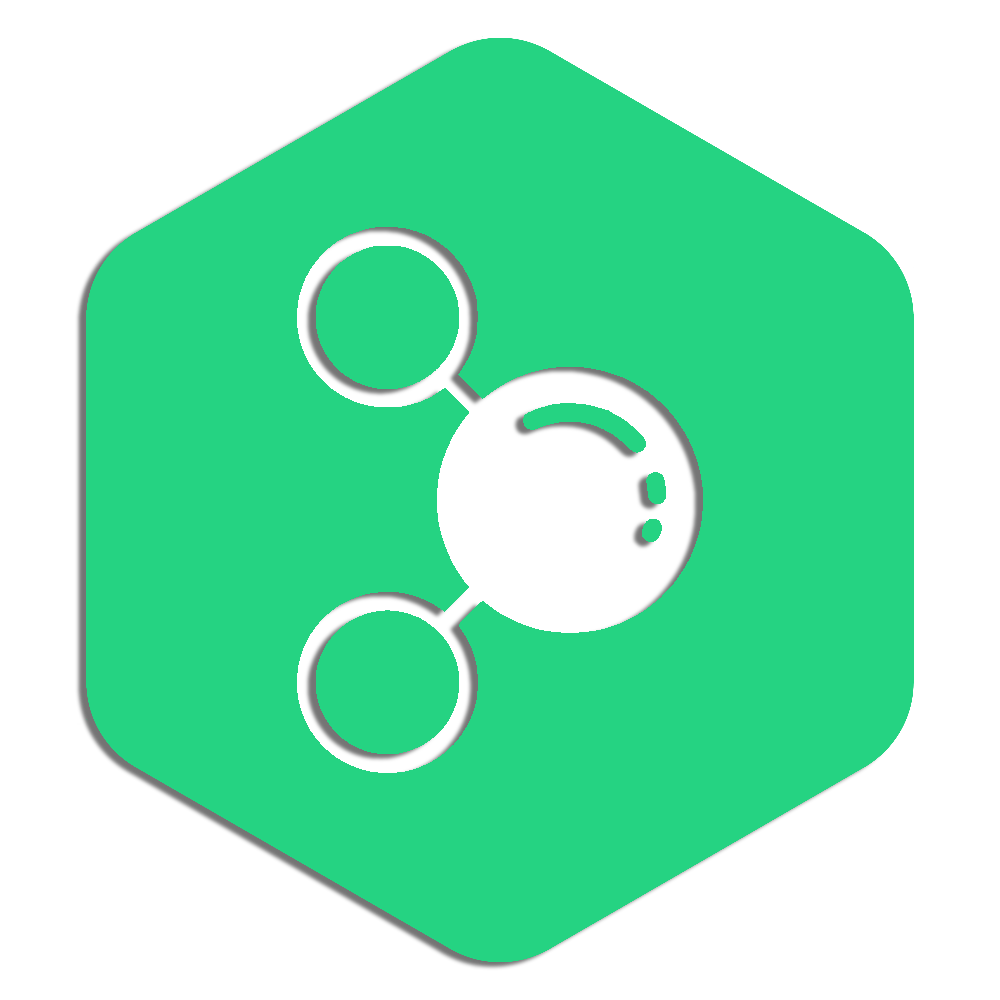
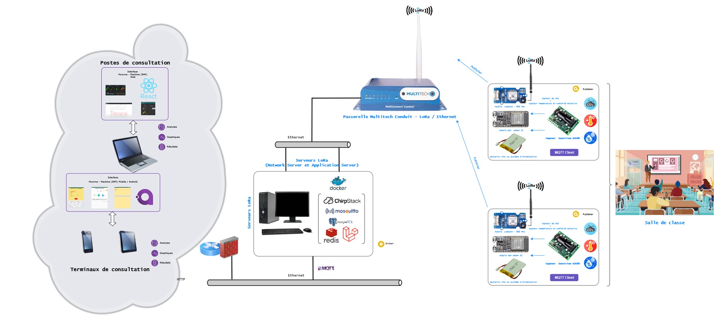
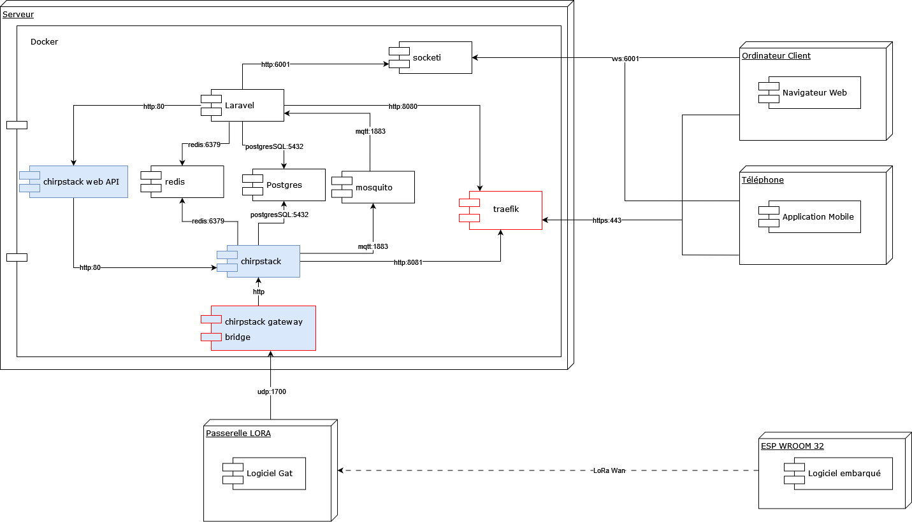
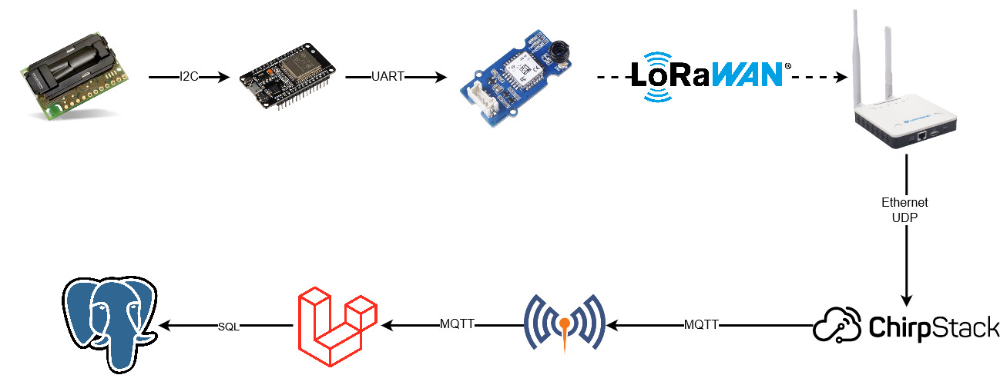
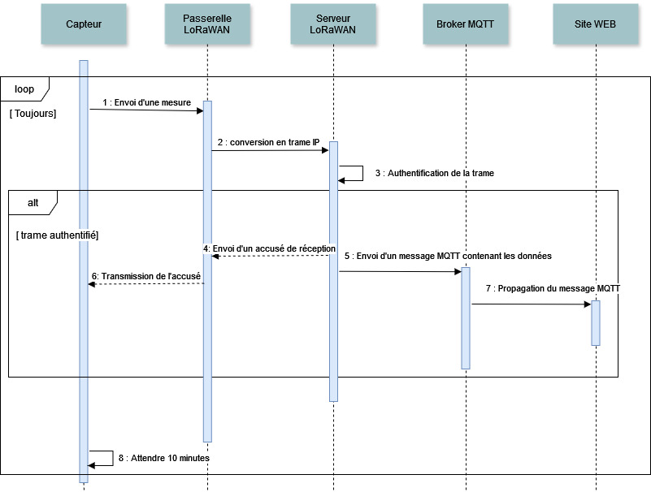

 

<h1 align="center"> Réseau de mesure de concentration de CO2 en milieux clos </h1>

 

    <a href="https://github.com/Blumilias/Co2-Hardware" width="25%">code des capteurs</a>
    <a href="https://github.com/SimonLou-Dev/CO2-WebSite" width="25%">site web</a>
    <a href="https://github.com/SimonLou-Dev/co2Docker" width="25%">infrastructure</a>

___

# Le Projet

Ce dépôt est une partie d'un projet réalisé en collaboration avec d'autres étudiants dans le cadre de mon projet de BTS au sein du lycée Henri Loritz à Nancy (2022-2024).

Voici ci-dessous le diagramme de contexte

## Le but

Le but du projet est d'installer un système de mesure de la concentration de CO2 dans l'ensemble du lycée afin de pouvoir évaluer facilement la qualité de l'air des salles de classe. En effet, une concentration trop élevée en CO2 peut être néfaste pour la concentration et peut provoquer des maux de tête.

## Décomposition

le projet se divise en trois partie, le site web, les capteurs et l'infrastructure.

Le site web est réalisé avec Laravel 11 et  React 19. L'infrstucture est réalisé grace à docker. Les capteur utilisent l'environement arduino

## Infrastructre

Pour représenter l'infrastructure, nous avons établi un diagramme de déploiement.

## Communication

Le projet utilise le protocole LoRaWAN pour établir une communication entre les capteurs et le serveur, ce qui permet une portée allant jusqu'à 10 km. Ci-dessous, la chaîne de communication allant de la mesure de la concentration de CO2 à l'enregistrement en base de données.

 

Voici le diagramme de séquence correspondant

 

